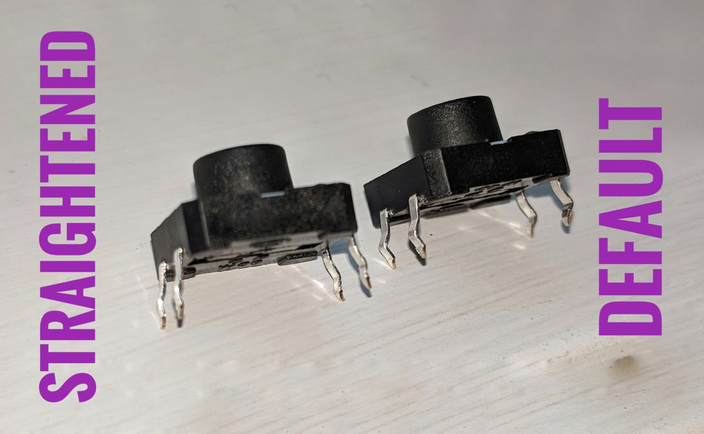

# Hello Raspberry Pi

Examples which demonstrate the use of Raspberry Pi and GPIO.

Of interest are those written in [rust](rs).

## Breadboard Diagrams

We used the following configuration for the `button`
example:

There are Fritzing diagrams available for these examples
in the [doc folder](doc).

You can [download Fritzing here](http://fritzing.org/home/).

## Learnings

Basic push buttons have legs which are bent by default.
This is helpful for soldering the buttons onto actual build,
but makes it difficult to get the button pushed into the
breadboard.

We used a pair of pliers to straighten out the pins on the
button, and made sure that we pushed the button all the
way down into the bread board.  This allowed us to establish
connectivity with the button after an initial period of failure.

## Linux GPIO docs

Linux GPIO subsystem documentation can be found at

* [top level](https://www.kernel.org/doc/Documentation/gpio/)
* [consumer interface for C programs](https://www.kernel.org/doc/Documentation/gpio/consumer.txt)
* [legacy interface using /sys/class/gpio](https://www.kernel.org/doc/Documentation/gpio/gpio-legacy.txt)

### Helper scripts

We included some helper scripts, available in the [helpers](helpers) directory,
which you can use to unexport pins which are still held in user
space after killing your app, or to test setting the output
value for a set of pins.

_These scripts use the legacy GPIO interface_ found in `/sys/class/gpio`, so if you're making an effort to understand
the C API for GPIO, please make sure that you refer to the [updated documentation](https://www.kernel.org/doc/Documentation/gpio/consumer.txt).

## Thank You - Blink Freely

