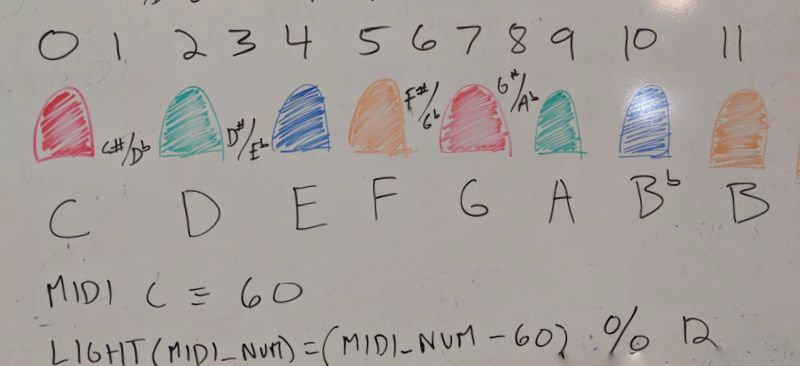

# midi_light_show

This project implements a simple LED light and music show which can be executed on a Raspberry Pi.

## Raspberry Pi LED Setup and Wiring

We used the following wiring setup on a Raspberry Pi 3 B+.  Be careful to check the GPIO pins of your specific model of Pi, as they may not match what is shown below.


## Coordinating LEDs with music

The idea behind which light to enable for which note is simple:  we only had enough jumper cables for 8 LEDs, so we decided to split the chromatic scale among those LEDs.  We'll show all the major tones of a C scale, as well as Bb, as individual, fully lit LEDs.  For the four remaining half steps, we'll power each "nearby light" at 50%.



## Implementation

Uses [rtmidi](https://github.com/thestk/rtmidi), [rimd](https://github.com/RustAudio/rimd) and [midir](https://github.com/Boddlnagg/midir) libs to read MIDI and output it to an audio device.

## Usage

We recommend downloading the JS Bach Goldberg Variations from https://www.opengoldbergvariations.org/.

```sh
cargo run ~/Documents/Goldberg_Variations.mid
```

We recommend listening to [Fredrik Johansson's MIDI repository](https://github.com/fredrik-johansson/midi), an excellent, extensive body of work!  Bravo!

## Building on Raspbian

You need to install `libsound2`.

```sh
sudo apt-get install libasound2-dev
```

At this point you can then build the `alsa` crate for rust on your Pi.

## Misc OS Configs

### Mac OS X

* Install SimpleSynth according to https://github.com/wbsoft/frescobaldi/wiki/MIDI-playback-on-Mac-OS-X

### Raspbian

### Virtual MIDI

Required reading: http://sandsoftwaresound.net/qsynth-fluidsynth-raspberry-pi/

Key insight:  you need to start `fluidsynth` as a server, allow MIDI input, connect it to your ALSA sound device on the Pi, and then correctly select the device number when starting this application:

```sh
fluidsynth -a alsa -i /usr/share/sounds/sf2/FluidR3_GM.sf2 --server
aconnect -lio   #  and COUNT the number of MIDI related devices
cargo run ~/Goldberg_Variations.mid 1  # if fluidsynth is the only virtual midi device on your pi, it should have ID 1.  see `aconnect -lio`
```

Helper command -- play a midi file to your speaker using `fluidsynth`:

```sh
fluidsynth -a alsa -n -i /usr/share/sounds/sf2/FluidR3_GM.sf ~/Goldberg_Variations.mid
```

See MIDI devices:

```sh
aconnect -lio
```

See sound cards:

```sh
aplay -l
```

## Acknowledgements

Bach's Goldberg Variations are [available under Creative Commons License here](https://www.opengoldbergvariations.org/).

Big thanks to [midir library](https://github.com/Boddlnagg/midir).

Big thanks to [rimd library](https://github.com/RustAudio/rimd).

Big thanks to [rtmidi library](https://github.com/thestk/rtmidi).

Thank you to [fluidsynth](http://www.fluidsynth.org/), which allowed us to send MIDI output to our audio device.
