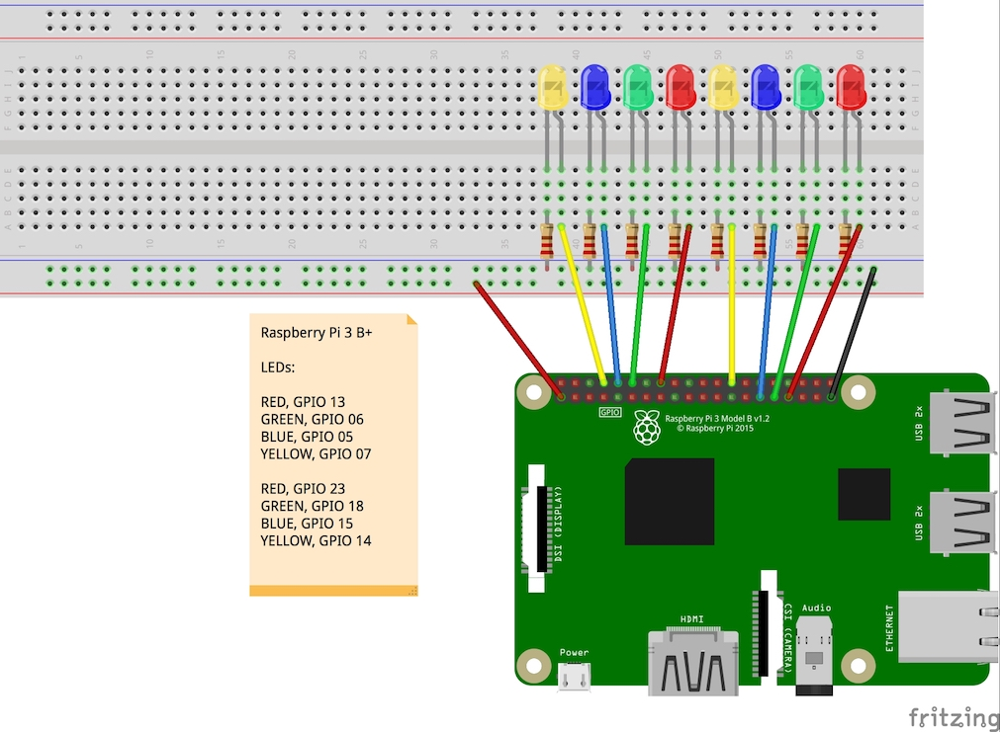

# midi_light_show

This project implements a simple LED light and music show which can be executed on a Raspberry Pi.  You can provide a MIDI file and it will display a pleasing series of blinkenlights.

[](http://www.youtube.com/watch?v=9y1bVPCvIWE "YouTube: Prototype MIDI Light Show on Raspberry Pi")

## Raspberry Pi LED Setup and Wiring

This project supports multiple LED layouts.  Shown below is the "basic" layout with eight LEDs.  Be careful to check the GPIO pins of your specific model of Pi, as they may not match what is shown below.



You can also choose an "extended" layout which uses additional LEDs, or specify additional layouts, by modifying the `[pins]` section of [Settings.toml](Settings.toml):

```toml
layout = "basic"   ## select which pin layout you want to use

[pins]
extended = [13, 6, 5, 7, 23, 18, 15, 14, 21, 26, 20, 16, 19, 11, 9, 10, 22, 27]
basic = [13, 6, 5, 7, 23, 18, 15, 14]
```

## Usage

We recommend downloading the JS Bach Goldberg Variations from https://www.opengoldbergvariations.org/.

You need to start `fluidsynth` as a server, allow MIDI input, connect it to your ALSA sound device on the Pi, and then correctly select the device number when starting this application:

```sh
sudo apt-get install fluidsynth fluid-soundfont-gm

fluidsynth -a alsa -i /usr/share/sounds/sf2/FluidR3_GM.sf2 --server

aconnect -lio   #  and COUNT the number of MIDI related devices

cargo run SOME_MIDI_FILE 1  # if fluidsynth is the only virtual midi device on your pi, it should have ID 1.  see above
```

## Building on Raspbian

You need to install `libsound2`.

```sh
sudo apt-get install libasound2-dev
```

At this point you can then build the `alsa` crate for rust on your Pi.

## Misc OS Configs

### Mac OS X

* Install SimpleSynth according to https://github.com/wbsoft/frescobaldi/wiki/MIDI-playback-on-Mac-OS-X

### Raspbian

### Virtual MIDI

Required reading: http://sandsoftwaresound.net/qsynth-fluidsynth-raspberry-pi/


Helper command -- play a midi file to your speaker using `fluidsynth`:

```sh
fluidsynth -a alsa -n -i /usr/share/sounds/sf2/FluidR3_GM.sf ~/Goldberg_Variations.mid
```

See MIDI devices:

```sh
aconnect -lio
```

See sound cards:

```sh
aplay -l
```

### Output to HDMI monitor

The easiest way to have your Raspberry Pi output sound in a timely fashion is to hook up an HDMI monitor and select it as the output source.

## Acknowledgements

Bach's Goldberg Variations are [available under Creative Commons License here](https://www.opengoldbergvariations.org/).

The availability of the following audio libraries is greatly appreciated:

* Big thanks to [midir library](https://github.com/Boddlnagg/midir).
* Big thanks to [rimd library](https://github.com/RustAudio/rimd).
* Big thanks to [rtmidi library](https://github.com/thestk/rtmidi).

Thank you to [fluidsynth](http://www.fluidsynth.org/), which allowed us to send MIDI output to an audio device on Raspberry Pi.

We recommend listening to selections from [Bernd Kreuger's Classical Piano MIDI Page](http://www.piano-midi.de/midi_files.htm).  There are a number of different composers represented here, and it was fun to try some of these out on the Pi!

We also recommend listening to [Fredrik Johansson's MIDI repository](https://github.com/fredrik-johansson/midi), an excellent, extensive body of work!  Bravo!  Their work is available for download.
