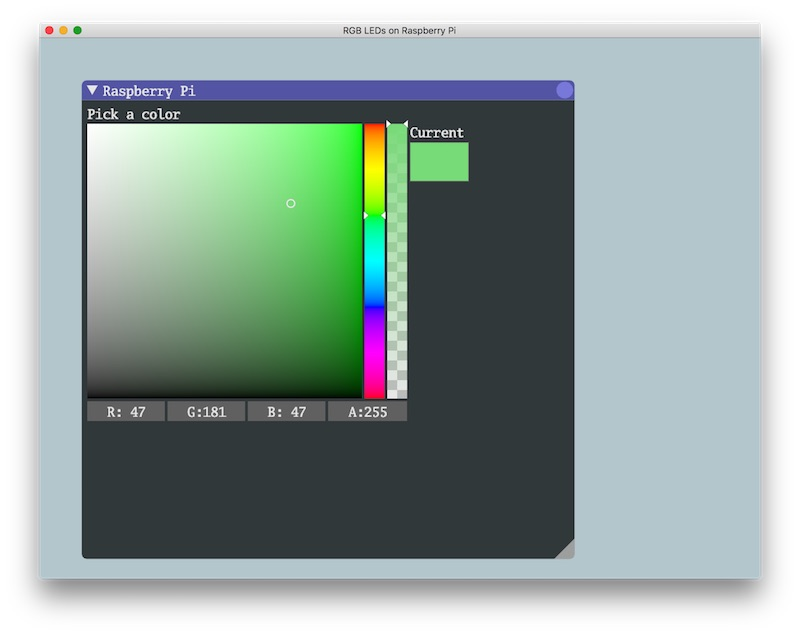

# pi_control

Raspberry Pi control board using Dear ImgUi.



## Cloning, Building, and Running

After you clone this repo, you need to initialize `imgui-rs`
git submodule:

```
git submodule update --init --recursive
```

## Acknowledgements

This project makes use of [Dear ImGui](https://github.com/ocornut/imgui).  Thank you.

Thank you to the [imgui-rs](https://github.com/Gekkio/imgui-rs) project
for providing rust bindings to imgui.

Thank you to the providers of [Go Mono](https://fontlibrary.org/en/font/go-mono) font.

Dear ImGui, imgu-rs, and Go Mono use the MIT license.
