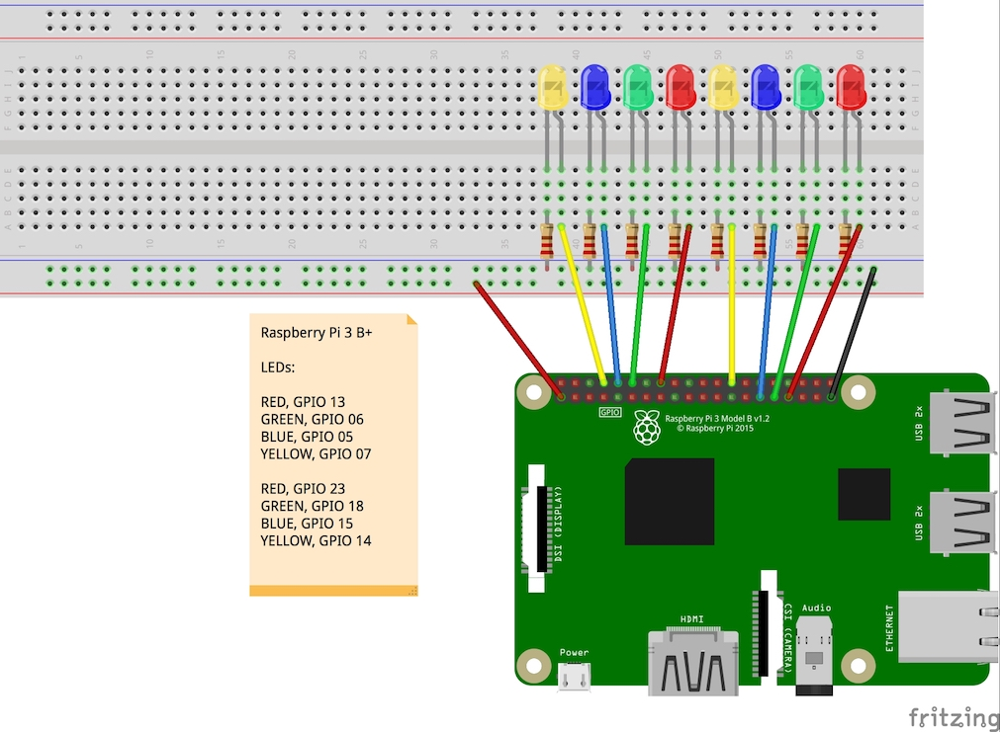
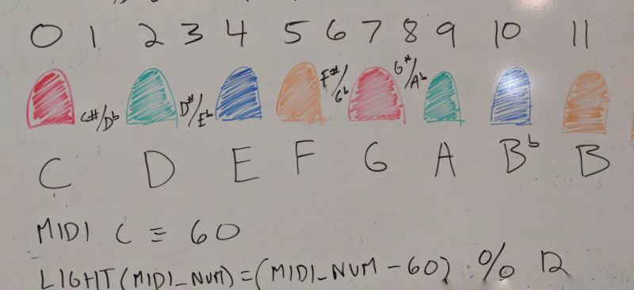

# midi_light_show

This project implements a simple LED light and music show which can be executed on a Raspberry Pi.

## Raspberry Pi LED Setup and Wiring

We used the following wiring setup on a Raspberry Pi 3 B+.  Be careful to check the GPIO pins of your specific model of Pi, as they may not match what is shown below.

## Coordinating LEDs with music

The idea behind which light to enable for which note is simple:  we only had enough jumper cables for 8 LEDs, so we decided to split the chromatic scale among those LEDs.  We'll show all the major tones of a C scale, as well as Bb, as individual, fully lit LEDs.  For the four remaining half steps, we'll power each "nearby light" at 50%.

